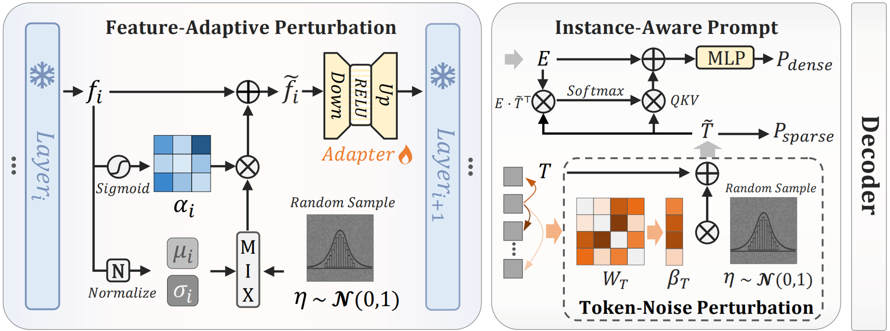

# Noise-Robust Tuning of SAM for Domain Generalized Ultrasound Image Segmentation
This is the official code of our MICCAI 2025 paper Nora 🥳

	

What's more, we also provide well-trained models at [Release](https://github.com/wkklavis/Nora/releases/tag/v.1.0.0). Please put it in the ./snapshot folder for evaluation. 